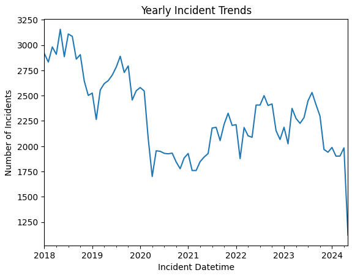

# SAN-FRANSISCO-S-CRIME-RATE

## PROBLEM STATEMENT

San Francisco is a combination of natural beauty, cultural richness and urban amenities. 
However, it is a nest of crimes and this project aims to leverage machine learning techniques to predict the rate of crime in the city over time

## OBJECTIVEs

To determine the rate of crime rate in San Francisco.

To show how the crime rate varies over time.

## METHODOLOGY

Data Wrangling: In this section, I imported the necessary libraries, loaded the data and cleaned the data by dropping unnecessary columns, rows and handling missing values.
Exploratory Data Analysis: In this section, I used various plots and graphs to have a better understanding of the data and draw insights.

Model Selection and Evaluation: In this section, I chose two time series models; Arima model and the Auto_Arima models. I first evaluated a baseline to see the threshold where my results should fall within. Differencing gave different results for both models.

## CONCLUSIONS

Seasonality and Trends: The data exhibited clear seasonal patterns and trends, highlighting the importance of incorporating these elements in forecasting models. Weekly seasonality in particular was a significant factor influencing crime rates.

Actionable Insights: The forecasting results offer actionable insights for city planners, emergency services and policy makers by anticipating periods of high incident rates, proactive measures can be taken to mitigate risks and enhance public safety.

## RECOMMENDATIONS

Regular Data Updates: Ensure that the incident data is updated regularly to keep the forecasts accurate and relevant. This will help in timely decision-making and resource allocation.

Continuous Monitoring and Model Improvement: Establish a system for continuous monitoring and evaluation of the forecasting models. Regularly assess model performance and update parameters or switch to more advanced models as necessary.
